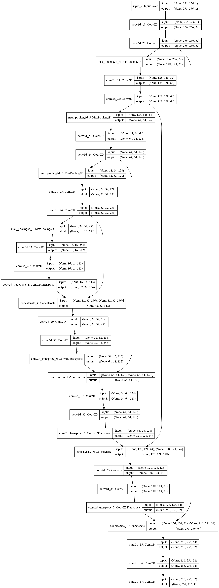
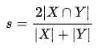
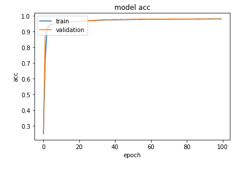
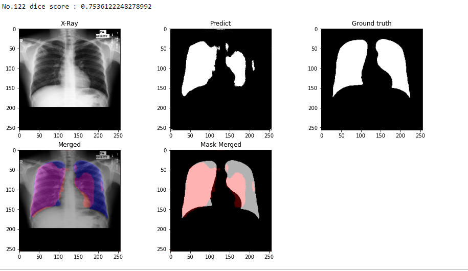

# Lung segmentation
## Dataset

https://www.kaggle.com/c/rsna-pneumonia-detection-challenge/overview
1. Montgomery County X-ray Set:
來源為美國衛生及公共服務部(United States Department of Health and Human
Services, HHS)的蒙哥馬利縣 (Montgomery County)分部肺結核控制計畫。資料集包含
138張由後向前拍攝的胸腔X光片，其中80張為正常胸腔，58張具有肺結核的表現。資料
格式為DICOM。
2. Shenzhen Hospital X-ray Set
來源為中國廣東省深圳第三人民醫院的日常看診。資料集包含662張胸腔X光片，
其中326張為正常胸腔，336張具有肺結核的表現。資料格式為JPEG。

## Methods
我們在前處理的時候將每張圖壓縮到 256*256 以減少計算量，並normailize每張圖
的灰階值成0到1之間的浮點數。
我們使用Tensorflow為平台，U-Net作為model struture，將Shenzhen Hospital
X-ray Set中有label mask的566筆資料作為training set，並內切20%作為validation set。
我們利用ModelCheckpoint監測validation loss，將model訓練100 epochs後，callback出
validation loss 最低的model。

Unet 架構參考 <a href = 'https://www.kaggle.com/eduardomineo/u-net-lung-segmentation-montgomery-shenzhen/comments'>U-Net lung segmentation (Montgomery + Shenzhen)</a>再進行調整

Network structure:

## Result
訓練完model後，拿Montgomery County X-ray set的資料當test dataset來做
prediction，並與ground truth做比對。

我們利用IOU與dice score來評估訓練的結果。
IOU 和 dice score 常用在影像切割的表現指標上。Dice score, 根據 Lee Raymond
Dice命名，是一種集合相似度度量函數，通常用於計算兩個樣本的相似度:

Intersection over Union(IOU)則是一種測量在特定數據集中檢測相應物體準確度的一個標
準。

* dice score and dice loss

* Result Visualization

### **Mean dice score : 0.769142**

### **Mean IOU score : 0.639804**

訓練完後，得到平均0.769的 dice score 和平均0.6398的 IOU score，隨機選擇一張test data疊圖後可以看到 ground truth和我們predict的差異和相同處，我們得到還不錯的結果。